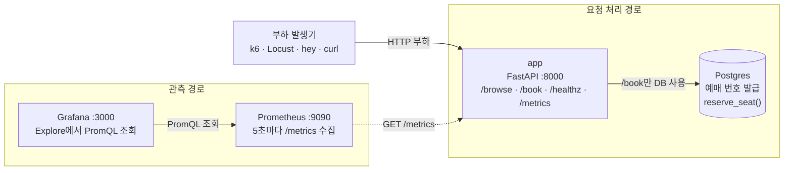

# bottleneck-lab — 병목을 직접 찾는 실습 킷

부하를 걸어 시스템의 처리 한계를 넘겨보고, **무엇이 병목인지 관측 데이터로 판단하는** 연습용 킷이다.
정답(병목이 어디에 심겨 있는지)은 이 저장소 어디에도 적혀 있지 않다. 그걸 찾는 게 이 실습이다.

**이 킷이 주는 것**: 문제 상황을 재현하는 서비스와, 그 서비스가 내보내는 관측 신호(메트릭·로그).
**네가 정하는 것**: 부하를 *어떻게* 걸지, *무엇으로* 병목을 증명할지, *어떤 신호*를 볼지. 전부 문제풀이자의 몫이다.

---

## 시나리오 & 네 역할

**공연 티켓 예매 서비스**를 운영한다.

- 평소엔 사람들이 좌석을 **둘러보기(`/browse`)**만 하다가, 티켓이 열리는 순간 **예매(`/book`)** 가 몰린다.
- 예매 한 건은 좌석을 확정하느라 뒤쪽 시스템에서 시간이 걸린다.

**너는 이 서비스의 운영 담당(SRE)이다.** 방금 팀 채널에 제보가 올라왔다:

> "티켓 오픈하면 예매가 먹통이 돼요. 근데 서버는 안 죽었대요. 뭐가 문제죠?"

이게 진짜 문제인지, 문제라면 원인이 무엇인지 **관측 데이터만으로** 판단해야 한다.
직접 부하를 걸어 이 상황을 재현하고, 근거를 대서 병목을 규명하라.

정답부터 찾으려 하기 전에, **예매 서비스 운영자의 기준**부터 세워라.
이런 서비스는 평소에 무엇이 잘 돌아가야 하고, 무엇이 어긋나면 문제가 되나?
그 기준을 먼저 스스로 정하고, 그 관점으로 지표를 읽어라.

---

## 구성

### 서비스 구성과 흐름



화살표를 두 종류로 나눠서 보면 된다.

- **요청 처리 경로:** 부하 발생기 → `app` → (`/book`인 경우) `Postgres`
- **관측 경로:** `Prometheus` → `app:/metrics`, `Grafana` → `Prometheus`

Prometheus와 Grafana는 요청을 대신 처리하는 서비스가 아니다. 부하는 `:8000`의 API에 걸고, `:9090`과 `:3000`은 그 결과를 조회하는 데 사용한다.

| 서비스 | 포트 | 용도 |
|--------|------|------|
| app | 8000 | 티켓 예매 API (`/book`, `/browse`, `/metrics`, `/healthz`) |
| Postgres | (내부) | 예매 처리 |
| Prometheus | 9090 | 메트릭 수집·질의 |
| Grafana | 3000 | 관측 도구 (익명 로그인). **대시보드는 안 깔아놨다** — 뭘 볼지는 네가 Explore에서 정한다. |

### API별로 거치는 구성요소

| 부하 대상 | 처리 경로 | 성격 | 실험에서의 용도 |
|-----------|-----------|------|-----------------|
| `GET /browse` | 부하 발생기 → app | DB를 사용하지 않는 가벼운 요청 | 앱 자체가 요청을 받을 수 있는지 확인하는 대조군 |
| `GET /book` | 부하 발생기 → app → DB 커넥션 풀 → Postgres | 좌석 확정을 흉내 내며 DB 커넥션을 일정 시간 사용 | 실제 예매 경로의 처리 한계와 대기 발생 여부 관찰 |
| `GET /healthz` | 부하 발생기 → app | 앱이 DB 풀을 생성했는지만 확인 | 기동 확인용. 성능 부하 대상으로는 적합하지 않음 |
| `GET /metrics` | Prometheus → app | 관측 지표 노출 | Prometheus가 수집하는 경로. 실험 부하와 섞지 않음 |

### 어디에 부하를 걸까

목적에 따라 부하 대상을 정한다.

1. **예매 장애를 재현하려면** `/book`에 부하를 건다.
2. **문제가 앱 전체인지 예매 경로에 한정되는지 비교하려면** 같은 조건으로 `/browse`와 `/book`을 각각 실행한다.
3. **티켓 오픈 상황을 가깝게 재현하려면** `/browse`가 계속 들어오는 상태에서 `/book` 부하를 계단식으로 높인다.

처음부터 최대 부하를 한 번에 넣기보다, 동시 사용자 수나 요청률을 단계적으로 높이면서 각 단계의 처리량·지연시간·오류율과 DB 풀 지표를 함께 기록하는 편이 처리 한계를 찾기 쉽다. `/browse`와 `/book`을 비교할 때는 부하 도구, 실행 시간, 동시성 또는 요청률을 같게 맞춘다.

---

## 실행

```bash
docker compose up --build -d      # 전부 띄우기 (처음엔 이미지 빌드로 몇 분)
curl localhost:8000/book          # 잘 뜨는지 확인 → {"booking_no": ...}
curl localhost:8000/browse        # 대조군(DB 안 거침)
```

정리:

```bash
docker compose down -v
```

---

## 관측 인터페이스 (볼 수 있는 것)

### 1. 메트릭 — `http://localhost:8000/metrics` (Prometheus가 5초마다 수집)

앱이 내보내는 커스텀 지표:

| 메트릭 | 타입 | 단위 | 라벨 | 의미 |
|--------|------|------|------|------|
| `http_requests_total` | Counter | 건 (누적, `rate()`로 req/s) | `route`, `status` | 경로·상태코드별 요청 수 |
| `http_request_duration_seconds` | Histogram | 초 | `route` | 요청 처리 시간 분포 (`_bucket`/`_sum`/`_count`) |
| `db_pool_connections_in_use` | Gauge | 커넥션 개수 | — | 현재 사용 중인 DB 커넥션 수 |
| `db_pool_waiters` | Gauge | 요청 개수 | — | DB 커넥션을 **기다리는** 요청 수 |
| `bookings_total` | Counter | 건 (누적) | `result` | 예매 성공/실패 건수 |

이 외에 `prometheus_client` 기본 지표도 함께 나온다:
`process_cpu_seconds_total`, `process_resident_memory_bytes`, `process_open_fds`, `python_gc_*` 등.

> 지표를 나열해 줬을 뿐, **이 중 무엇이 지금 문제를 설명하는지는 알려주지 않는다.**
> 가장 크게 튀는 값 하나를 정답으로 고르지 마라. 무엇이 평소이고, 지금 그와 어떻게 다른지를 근거로 판단하라.

### 2. 로그

```bash
docker compose logs -f app        # uvicorn 액세스 로그 (요청 경로·상태코드)
docker compose logs -f db         # Postgres 로그
```

### 3. 질의 도구

- **Prometheus**: `http://localhost:9090` — PromQL 직접 질의
- **Grafana**: `http://localhost:3000` — Explore에서 같은 Prometheus에 질의. 패널은 네가 만든다.

---

## 부하는 네가 건다

어떤 도구로 어떻게 걸지는 정해주지 않는다. `k6`, `locust`, `hey`, `vegeta`, `wrk`, 심지어 `curl` 루프까지 — 네가 고른다.
(`k6/health-baseline.js`에 k6 스크립트 예시가 하나 있다. 어디까지나 문법 참고용이다 —
그 스크립트가 치는 경로가 네 실험 목적에 맞는지부터 판단하고 쓸 것.)

**부하를 걸기 전에 평시부터 기록해라.** 부하 없이(또는 아주 약한 부하로) 각 지표의
평상시 값을 먼저 적어둔다. 평시를 모르면 "지금 이상하다"를 말할 기준이 없다.
"정상과 다르다"는 판단은 전부 이 기록과의 비교에서 나온다.

스스로 정할 것:

- **어디를** 칠 건가? (`/book`? `/browse`? 둘 다?)
- **얼마나** 올릴 건가? 한 번에? 계단식으로? 처리 한계를 어떻게 찾을 건가?
- **무엇을** 보면 "한계를 넘었다"고 말할 건가?

> 부하를 걸기 전에 가설부터 세워두면 결과를 채점할 수 있다.
> "요청을 올리면 제일 먼저 무너지는 게 뭘까? 왜?" — 틀려도 된다. 세워놓고 시작하는 게 중요하다.

---

## 판단 정리 (실습의 결과물)

관측이 끝나면 이 다섯 가지를 **근거와 함께** 남긴다.

1. **직접 본 사실** — 어떤 지표/로그가, 언제부터, 얼마나 움직였나 (숫자로, 평시 대비).
2. **그 사실에서 내린 판단** — 병목은 무엇인가.
3. **그 판단을 깨뜨릴 수 있었던 관측** — 만약 CPU가 범인이었다면 뭐가 같이 보였어야 하나? 그걸 데이터로 확인했나?
4. **오탐 후보** — 이상처럼 보였지만 정상이거나 무해했던 신호는 무엇이고, 왜 그렇게 판단했나?
5. **지금 데이터로 확정 못 하는 것** — 여기까지는 말 못 한다는 선.

> 판단의 임계값이나 정답은 하나로 정해져 있지 않다.
> 채점은 숫자 하나가 아니라 **재현 가능한 근거와 반증**을 본다.

---

## 실험 손잡이

`docker-compose.yml`의 `POOL_SIZE`를 바꾸고 `docker compose up -d --build app`으로 다시 띄운 뒤 같은 부하를 걸어봐라.
- 처리 한계가 어떻게 달라지나? 그게 네 판단을 뒷받침하나, 반증하나?
- 그냥 이 값을 키우면 다 해결되나? **그 대가는 뭔가?** (공짜는 없다.)

---

## 다음 단계 (이 킷을 씨앗으로)

병목을 규명했다면, 그 판단을 **"다음엔 미리 잡아내는 탐지 기준"** 으로 옮겨봐라.
어떤 지표가 **선행 신호**였나(터진 뒤 알려주는 후행 지표 말고)? 정상과 이상의 경계를 어디에, 무슨 근거로 그을 건가?
이렇게 쌓은 "증상 → 원인 → 판단 근거" 기록이 나중에 AIOps 에이전트가 검색할 장애 이력(RAG)의 원본이 된다.
