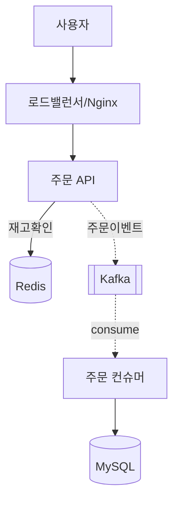

# 설계 가이드라인 (처음 설계하는 사람을 위해)

> 설계는 "멋진 그림 그리기"가 아니다. **요구사항과 제약을 파악하고, 여러 선택지 중 근거를 가지고 고르고, 그 이유를 남기는 것**이다. 코드보다 먼저, 판단이 있다.

## 0. 설계의 3단계 (이 순서를 지켜라)

```
① 무엇을 만들 것인가 (요구사항)  →  ② 무엇을 지켜야 하나 (제약·비기능)  →  ③ 어떻게 만들 것인가 (구조·선택)
```

초보가 가장 많이 하는 실수: ①②를 건너뛰고 바로 ③(기술 선택)으로 간다. → "왜 Kafka?"에 답을 못 한다. **항상 문제부터.**

## 1. 요구사항 정의

### 기능 요구사항 (What)
"시스템이 무엇을 하는가"를 동사로.
- 예: 사용자는 상품을 조회한다 / 세일 중 주문한다 / 재고 소진 시 실패 응답을 받는다

### 비기능 요구사항 (How well) — ★ 설계의 진짜 핵심
숫자로 목표를 박아라. 숫자가 없으면 "잘 됐다"를 증명 못 한다.

| 축 | 질문 | 이 실습의 예시 목표 |
|----|------|--------------------|
| 성능 | 동시 몇 명? P99 몇 ms? | 1,000 동시요청, P99 ≤ 300ms |
| 정합성 | 무엇이 절대 깨지면 안 되나 | 재고 초과판매 0건 |
| 가용성 | 하나 죽어도 되나 | broker 1개 죽어도 주문 계속 |
| 확장성 | 부하 늘면 어떻게 | 인스턴스 늘려 처리량 선형 증가 |
| 비용 | 얼마까지 | (실무: 클라우드 예산 한도) |
| 운영 | 문제를 어떻게 아나 | RPS·에러율·지연 관측, 이상 시 알림 |

> **팁**: 비기능 목표가 곧 Day 3 부하테스트의 합격/불합격 기준이 된다. 지금 정한다.

## 2. 구조 설계 — C4로 위에서 아래로

한 번에 다 그리지 말고 **줌인**한다.

1. **Context (맥락)**: 시스템 = 상자 하나. 밖에 누가 있나? (사용자, 외부 서비스)
2. **Container (컨테이너)**: 상자 안을 배포 단위로 쪼갠다. (웹앱, API, DB, 캐시, 큐, 관측스택) ← **이 실습은 여기까지가 메인**
3. **Component (컴포넌트)**: 한 컨테이너 안의 모듈. (주문서비스 안의 재고검증·큐발행·컨슈머)

각 단계에서 **화살표 = 데이터/요청 흐름**. 화살표마다 "동기냐 비동기냐", "무슨 데이터냐"를 적어라.

## 3. 다이어그램 그리는 법

- 도구: [draw.io](https://draw.io), Excalidraw, 또는 텍스트로 Mermaid/Graphviz (버전관리됨)
- 규칙:
  - 왼쪽→오른쪽 or 위→아래로 **트래픽이 흐르는 방향** 통일
  - 컴포넌트는 **네모**, 사용자·외부는 **다른 모양**
  - 동기 호출 = 실선, 비동기/이벤트 = 점선, 스케일·배포 = 다른 색
  - 그룹(VPC·plane)은 **묶어서 배경색**
- Mermaid 예시 (`ARCHITECTURE.md`에 붙여 쓰기):



## 4. "왜?"를 남기는 법 — 결정 로그(ADR)

기술을 고를 때마다 [결정 로그 템플릿](../templates/DECISION_LOG.md)에 한 건:

```
문제: 무엇을 해결하려는가
대안: A / B / C
트레이드오프: 각각의 장단점 + 우리 상황에서의 무게
결정: X를 선택
근거: 왜 X인가 (비기능 목표와 연결)
```

> 이게 발표 질의응답의 90%를 방어한다. "왜 그렇게 했어요?" → 결정 로그 열기.

## 5. 설계 리뷰 체크리스트 (Day 1 끝에 스스로 점검)

- [ ] 비기능 목표가 **숫자로** 있다
- [ ] 모든 화살표에 동기/비동기·데이터가 명시됐다
- [ ] **단일 장애점(SPOF)**을 찾아봤다 (하나 죽으면 전체가 멈추는 지점)
- [ ] 재고 정합성을 어디서 어떻게 지키는지 명확하다
- [ ] 각 기술 선택마다 결정 로그가 있다
- [ ] "가장 단순하게 시작"했는가? (처음부터 3-broker·K8s로 시작하지 말 것)

## 6. 초보가 자주 하는 실수 (피하기)

1. **기술부터 고른다** → 문제부터. "Kafka 써야지"가 아니라 "폭주를 완충해야 하는데 방법이?"
2. **처음부터 완벽·복잡하게** → 동기 단순 버전 먼저 만들고, 문제를 만난 뒤 비동기로. (Day 2가 이 순서)
3. **비기능 목표 없음** → 무엇을 향해 가는지 모른 채 구현
4. **결정을 기록 안 함** → 나중에 "왜 이렇게 했지?" 못 답함
5. **관측 없이 최적화** → 병목을 추측으로 건드림. 측정 먼저.

## 참고: 이 실습에서 마주칠 핵심 설계 질문 (미리 생각)

- 재고 차감: **DB 락 vs Redis 원자연산(DECR)** — 정합성 vs 성능
- 주문 처리: **동기 즉시 vs Kafka 큐 완충** — 응답성 vs 폭주 방어
- 실패 처리: **재시도/DLT를 어디에** — 정상 요청을 막지 않으려면
- → 전부 [트레이드오프 체크리스트](TRADEOFFS_CHECKLIST.md)에 정리돼 있다
