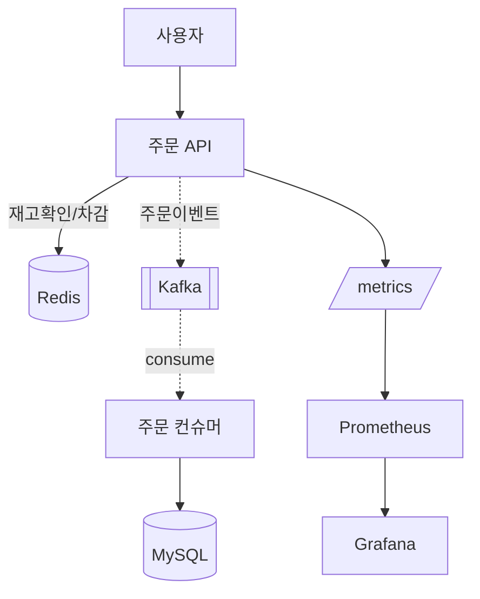

# 아키텍처 설계서 — 미니 플래시세일

> Day 1 산출물. [설계 가이드라인](../guides/DESIGN_GUIDE.md)을 따라 채운다.

## 1. 요구사항

### 기능 요구사항
- [ ] 사용자는 ...
- [ ] 세일이 시작되면 ...
- [ ] 재고 소진 시 ...

### 비기능 요구사항 (숫자로!)
| 축 | 목표 | 측정 방법 |
|----|------|-----------|
| 성능 | 동시 ___ 요청, P99 ≤ ___ ms | k6 |
| 정합성 | 재고 초과판매 0건 | 성공응답 수 == 재고 |
| 가용성 | broker 1개 죽어도 주문 지속 | 장애주입 |
| 확장성 | | |
| 관측 | RPS·P99·에러율 대시보드 | Grafana |

## 2. 시스템 컨텍스트 (누가 이 시스템을 쓰나)

_(외부 액터와 시스템 경계)_

## 3. 컨테이너 다이어그램

_(위 예시를 우리 설계로 수정. 실선=동기, 점선=비동기)_

## 4. 핵심 흐름 설명

- **주문 흐름**: ...
- **재고 정합성 보장 지점**: ...
- **실패 처리**: ...

## 5. 단일 장애점(SPOF) 분석

| 컴포넌트 | 죽으면? | 대응 |
|----------|---------|------|
| | | |

## 6. 관련 결정 로그

- [ ] DEC-001 재고 차감 방식 → `DECISION_LOG.md`
- [ ] DEC-002 동기 vs 비동기
- [ ] DEC-003 브로커 선택
