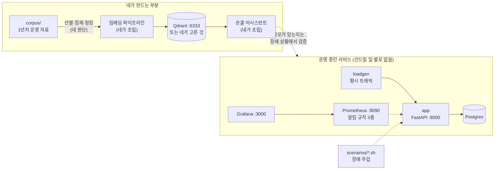

# rag-ops-lab — 운영 지식을 검색하게 만드는 실습 킷

**공연 티켓 예매 서비스**를 운영한다. 평소엔 사람들이 좌석을 둘러보기(`/browse`)만
하다가, 티켓이 열리는 순간 예매(`/book`)가 몰린다. 평시엔 조용하고 오픈 순간에만
터지는 스파이크형 서비스다. 예매 확정 뒤 결제는 외부 PG사('페이게이트')를 거친다.

서비스 오픈 후 1년. 그동안 장애가 몇 번 났고, 회고·런북·위키·슬랙 로그가
`corpus/`에 쌓였다. 이 실습은 그 자료 더미로 **RAG 기반 온콜 어시스턴트** —
AIOps의 출발점 — 를 네 손으로 만드는 것이다.

정답(어떤 자료를 넣어야 하는지, 어떻게 잘라야 하는지, 어떤 스택이 맞는지)은
이 저장소 어디에도 없다. **그걸 판단하는 게 이 실습이다.**

**이 킷이 주는 것**: 살아 있는 서비스와 알림, 1년치 운영 자료(일부러 현실만큼 지저분하다),
벡터 DB, 임베딩 비용 계산기, 장애 주입 스크립트.
**네가 정하는 것**: 무엇을 임베딩할지, 어떻게 자를지, 무엇으로 조립할지,
그리고 **RAG가 어디까지 해주고 어디부터 못 해주는지의 선.**

---

## 이 실습이 끝나면 답할 수 있어야 하는 질문

전부 "왜"와 숫자가 붙어야 답으로 친다.

1. RAG를 이 시스템의 **어디에** 적용했나? 왜 거기인가?
2. **어떤 자료로** RAG의 기반을 만들었나? 버린 자료는 왜 버렸나?
3. 이걸로 AIOps의 **어떤 부분**이 나아졌나? 무엇이 몇 분에서 몇 분이 됐나?
4. 임베딩 **비용을 줄이기 위해** 자료(마크다운)를 어떻게 재구성했고, 몇 토큰이 줄었나?
5. 이 문제는 **RAG 구축만으로 해결되는 문제인가?** 아니라면 무엇이 더 필요한가?
6. 네 어시스턴트의 답을 **언제 믿고 언제 의심할 건가?** 그 기준은 무엇인가?

---

## 시나리오 & 네 역할

**너는 이 서비스를 운영하는 플랫폼팀의 다섯 번째 멤버, 신규 온콜 엔지니어다.**

팀 구성: 플랫폼 리드 서태오, 백엔드 박지우, 온콜 선배 김한결, CS 창구 정은비.
그리고 너. 두 달 뒤면 너도 온콜 로테이션에 들어간다.

팀의 R&R은 이렇다 — 예매 API·DB·관측(알림 포함)은 우리 팀 책임이다.
결제 승인 자체는 페이게이트 소관이라 걔네 장애를 우리가 고칠 수는 없다.
하지만 **감지하고, 영향 범위를 판단하고, 대응하는 건 우리 몫이다.**

첫 주에 선배(김한결)가 이렇게 말했다:

> "새벽에 알림 오면 `corpus/` 폴더 뒤져. 어딘가엔 답 있어. 어디 있는지는 나도 몰라."

실제로 뒤져보면 안다 — 잘 쓴 문서와 못 쓴 문서, 낡은 문서와 맞는 문서,
그리고 진짜 중요한 정보가 채팅 로그에 파묻혀 있는 현실을. 그리고 팀장의 지시:

> "쌓인 자료로 온콜 어시스턴트 만들어봐. 단, **임베딩이랑 LLM API 비용 결재는 내가 한다.**
> 왜 그 토큰이 필요한지 설명 못 하면 반려할 거야."

---

## 구성



| 구성 요소 | 포트 | 용도 |
|-----------|------|------|
| app | 8000 | 티켓 예매 API + 장애 주입 스위치(`/admin/fault/*`) |
| loadgen | — | 평시 트래픽(browse ~10rps, book ~6rps). 알림이 울리려면 트래픽이 있어야 한다 |
| Prometheus | 9090 | 메트릭 수집 + 알림 3종 (`/alerts`에서 확인) |
| Grafana | 3000 | 관측 도구 (익명 로그인) |
| Qdrant | 6333 | 벡터 DB. 직접 조립파를 위해 미리 띄워둠 |
| `corpus/` | — | 컨테이너가 아니다. RAG의 원료가 될 자료 더미 |

LLM·임베딩 API 키는 이 킷이 제공하지 않는다. 수업에서 쓰던 것(Dify, OpenAI/기타 API)을 가져와라.

## 실행

```bash
docker compose up --build -d
curl localhost:8000/book        # {"booking_no": ...} 나오면 정상
open http://localhost:9090/alerts
```

정리:

```bash
docker compose down -v
```

---

## 자료 더미 (corpus/)

| 파일 | 형태 |
|------|------|
| `postmortems/2026-03-14-booking-latency.md` | 장애 회고 |
| `postmortems/2026-05-02-payment-timeout.md` | 장애 회고 |
| `runbooks/high-latency.md` | 런북 |
| `runbooks/db-connection-pool.md` | 런북 |
| `wiki/architecture.md` | 위키 |
| `wiki/onboarding.md` | 위키 |
| `alerts/alert-catalog.md` | 알림 정의 |
| `chat-dumps/2026-05-02-incident-channel.txt` | 슬랙 원본 로그 |

이 문서들이 전부 옳다고, 전부 최신이라고, 전부 쓸모 있다고 **아무도 말한 적 없다.**
현업 위키가 그렇듯이. 실사(due diligence)는 네 몫이다.

---

## 미션

### 0단계 — 평시를 알아둔다

장애를 재현하기 전에 평시 지표부터 눈에 익혀라. 평시를 모르면 이상을 판단할 수 없다.
`/book` P95, 실패율, `db_pool_waiters`의 평상시 값을 기록해둔다.

### 1단계 — 자료 실사: 무엇을 넣을 것인가

`corpus/`를 **전부 읽어라.** 대충 넘기지 말고. 읽으면서 문서마다 판단표를 채운다:

| 파일 | 넣는다/버린다/고쳐서 넣는다 | 이유 (한 줄) |
|------|------|------|

- 판단 포인트: 문서에 적힌 내용과 **지금 환경(`docker-compose.yml`, 실제 지표)**이 일치하는가?
- 판단 포인트: "장애 중에 나올 질문"에 이 문서가 답이 되는가? 안 되면 왜 넣는가?
- 전부 넣는 것도 선택이다. 단, 그 선택의 대가를 말할 수 있어야 한다.

### 2단계 — 임베딩 설계: 얼마짜리로 만들 것인가

팀장 결재를 받아야 한다. 숫자를 만들어라.

```bash
python3 tools/estimate_tokens.py                      # 원본 그대로 넣으면 얼마인가
python3 tools/estimate_tokens.py --chunk-size 200 --overlap 30   # 설정을 바꾸면?
```

- 1단계에서 "고쳐서 넣는다"로 판정한 자료를 실제로 고쳐라(별도 폴더 추천, 예: `corpus-cleaned/`).
  고친 뒤 `--dir corpus-cleaned`로 다시 계산해서 **전/후 토큰 수를 비교**한다.
- 판단 포인트: 청크 크기와 오버랩을 왜 그 값으로 했나? 기본값을 썼다면 그것도 선택인가?
- 판단 포인트: 비용이 줄어드는 만큼 잃는 것은 무엇인가? (공짜 절감은 없다)

### 3단계 — RAG 조립: 무엇으로 만들 것인가

스택은 정해주지 않는다. 최소 두 개 후보를 놓고 트레이드오프 표를 **직접 채운 뒤** 골라라.

| 후보 | 얻는 것 | 내주는 것 | 내 상황에서의 결론 |
|------|---------|-----------|--------------------|
| Dify (수업에서 씀) | | | |
| LangChain/LlamaIndex + Qdrant | | | |
| 프레임워크 없이 직접 (임베딩 API + qdrant-client) | | | |

"수업에서 써봐서 익숙하다"도 근거다. "몰라서 아무거나"는 근거가 아니다.

만들고 나면 **평가 세트로 채점하라.** 온콜이 던질 질문 10개를 만들고
(예상 정답 문서까지 미리 적은 뒤) 검색이 그걸 가져오는지 확인한다.
"몇 개 물어보니 잘 되던데요"는 채점이 아니다.

### 4단계 — 실전 온콜: 장애 상황에서 검증한다

시나리오를 하나씩 주입하고, **관측 → 판단 → 어시스턴트 질의**를 실제 온콜처럼 돌린다.

```bash
./scenarios/scenario-1.sh     # 끝나면 ./scenarios/reset.sh
./scenarios/scenario-2.sh
./scenarios/scenario-3.sh
```

각 시나리오에서 어시스턴트에게 최소한 이런 질문들을 던져보고, 답의 품질을 기록한다:

- "지금 뜬 알림이 뭘 의미하고, 뭐부터 봐야 해?"
- "예전에 비슷한 장애가 있었어? 그때 뭐가 원인이었고 뭘 했어?"
- "지금 /book P95가 얼마야?" ← 이 질문의 결과를 특히 잘 기록해라
- "POOL_SIZE는 지금 얼마로 되어 있어?" ← 이것도. 답과 실제 환경을 대조해라

기록 양식 — 답을 세 부류로 나눈다:

| 질문 | 좋은 답 | 틀렸는데 자신 있는 답 | 답 못 함 |
|------|---------|----------------------|----------|

두 번째 부류가 나왔다면 축하한다. **이 실습에서 제일 값진 데이터를 얻은 것이다.**
왜 그런 답이 나왔는지 원인(어느 문서? 어느 청크?)까지 추적해라.

### 5단계 — 판단 정리 (실습의 결과물)

`JUDGEMENT.md`를 작성한다. 맨 위 질문 6개에 대해 **근거와 숫자를 붙여** 답한다.
특히 5번 — 시나리오 셋을 겪고 나면 RAG가 잘 답한 질문과 못 답한 질문이 갈렸을 것이다.
그 경계선이 어디였는지, 경계 너머를 채우려면 무엇이 필요한지
(실시간 지표 질의? 문서 갱신 프로세스? 사람의 판단?) 네 데이터로 말해라.

---

## 힌트 (hints/)

막혔을 때만 연다. 열기 전에 **자기 가설을 한 줄 적고** 열어라. 그래야 힌트가 채점이 된다.

| 파일 | 언제 여나 |
|------|-----------|
| `HINT-1-자료-선별.md` | 1단계에서 뭘 넣을지 기준이 안 설 때 |
| `HINT-2-마크다운과-청킹.md` | 2단계에서 청킹·재구성 방향이 안 잡힐 때 |
| `HINT-3-검색-품질-평가.md` | 3단계에서 "잘 되는지"를 어떻게 확인할지 모를 때 |
| `HINT-4-RAG의-경계.md` | 5단계에서 "RAG만으로 되나"에 답이 안 나올 때 |

---

## 다음 단계 (이 킷을 씨앗으로)

어시스턴트가 문서 검색을 넘어 **지금 값을 직접 조회**하게 만들면 (Prometheus HTTP API,
tool calling), 그때부터가 진짜 AIOps다. 그리고 그 어시스턴트가 내놓는 건 결론이 아니라
가설이다 — 엔터는 여전히 네가 누른다.
